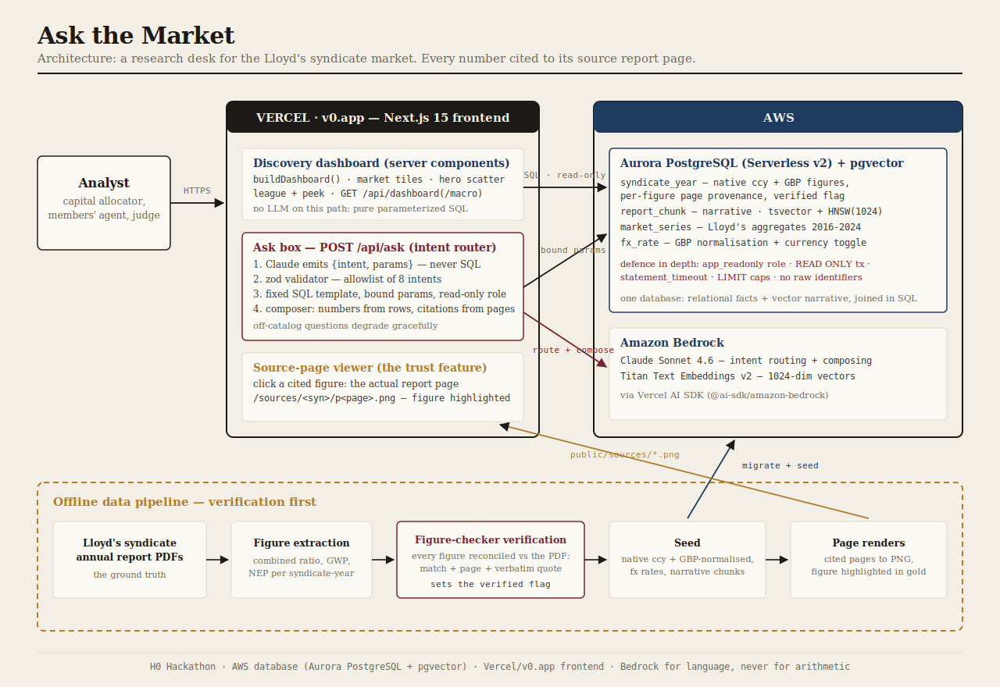

# Ask the Market

Ask the Lloyd's of London insurance market a question in plain English. Get a ranked,
GBP-normalised answer where **every number is cited to the exact page of the source
annual report**, and clicking a figure opens that actual page with the number
highlighted.

Built for the **H0 Hackathon** (Vercel v0 + AWS Databases), Monetizable B2B track.



## Why

Every Lloyd's syndicate publishes its results inside a 50-200 page annual-report PDF.
The people who allocate capital across syndicates (analysts, members' agents, capital
providers) hand-dig through those PDFs every results season. Questions like *"which
syndicates grew premium while improving their combined ratio?"* take an analyst days.
Ask the Market answers them in seconds, and proves every figure.

Trust is the product: a financial answer you cannot verify is worthless. So every
figure carries page-level provenance, a `verified` flag set by reconciling it against
the PDF, and a one-click view of the source page.

## Stack (the H0 pairing)

| Layer | Choice |
|---|---|
| Database | **Aurora PostgreSQL (Serverless v2) + pgvector** - one DB for relational facts AND vector narrative, joined in SQL |
| Frontend | **Next.js 15 on Vercel / v0.app** - server components read the DB directly |
| AI | **AWS Bedrock** via the Vercel AI SDK: Claude Sonnet 4.6 (routing + composing), Titan Text Embeddings v2 (1024-dim) |
| Pooling | `attachDatabasePool` from `@vercel/functions` (Fluid Compute) |

## The safety model: the LLM never writes SQL

```
NL question
  -> Bedrock Claude ROUTER (structured output) => {intent, params}   never SQL
  -> zod validator: intent in catalog? params allowlisted?           reject => graceful degrade
  -> fixed parameterized SQL template on a READ-ONLY role            statement_timeout + LIMIT
     + scoped pgvector retrieval for narrative
  -> Bedrock Claude COMPOSER: numbers from rows, citations from provenance columns
  -> answer => each number links to its source report page
```

The model picks one of **8 allowlisted intents** (rank, trend, compare,
growers_improvers, peer_percentile, market_overview, explain_change, narrative_search)
and fills validated params. Numbers render from fact rows, citations from provenance
columns, so a figure cannot be hallucinated. Defence in depth: SELECT-only role,
READ ONLY transaction, statement timeout, row caps.

## Citation integrity by construction

- Figures are stored in their **native currency and unit** (what the PDF literally
  prints) plus a precomputed GBP value for cross-syndicate ranking. A currency toggle
  re-bases displays; the peek always shows the as-filed value, so a clicked number
  matches the page.
- Every figure in the demo dataset was **reconciled against the source PDF** (match +
  page + verbatim quote) before earning `verified = true`.
- The cited pages are pre-rendered to PNG with the figure highlighted, so
  click-to-source is instant.

## Two data layers, one hard boundary

1. **Micro (per-syndicate, cited):** combined ratio, GWP, NEP per syndicate-year with
   page provenance. Click-to-source.
2. **Macro (market context):** Lloyd's market-wide aggregates 2016-2024
   (`market_series`). Labelled context, never wired to the page viewer.

Blurring those would let an uncited aggregate masquerade as a cited figure, which is
exactly the failure the product exists to prevent.

## Run it

```bash
npm install
cp .env.example .env.local    # fill: AWS_REGION + creds, DATABASE_URL, READONLY_DATABASE_URL
npm run migrate               # forward-only migrations (schema, roles, views, market_series)
npm run seed:spike            # verified syndicate figures + narrative (SKIP_EMBED=1 to skip Bedrock)
npm run seed:market           # Lloyd's market-context series
npm run dev                   # http://localhost:3000
```

Local development works end to end on Docker Postgres with **zero AWS dependencies**
(`SKIP_EMBED=1`): the dashboard, source viewer, quotes and toggles are pure SQL. Only
the natural-language Ask box needs Bedrock.

```bash
docker run -d --name h0pg -p 5433:5432 -e POSTGRES_PASSWORD=pw -e POSTGRES_DB=syndicate pgvector/pgvector:pg16
```

In production, Aurora is provisioned through the Vercel AWS integration and Bedrock
model access is enabled once in the AWS console (Claude + Titan).

## Tests (real database, no mocks)

```bash
npm run test       # validator unit tests: allowlist rejects injection / off-list params
npm run test:int   # integration on real Postgres: read-only blocks writes, timeout fires,
                   # FX inversion, narrative quote selection
```

## Layout

```
app/                  Next.js App Router. page.tsx = the research-desk dashboard.
app/components/       ask-box, league-with-peek, source-viewer, macro-context, toggles.
app/api/ask           the NL endpoint (router -> validator -> catalog -> composer).
app/api/dashboard     deterministic chart data (no LLM on this path).
lib/                  ask pipeline, db (read-only exec), fx, quotes, dashboard, macro.
lib/intents/          the query catalog (the ONLY queries that can run) + validator.
db/migrations/        schema, read-only role, materialized views, market_series.
db/seed-spike.ts      loads the verified dataset (+ embeddings when Bedrock is available).
db/seed-market.ts     loads the market-context series.
public/sources/       pre-rendered cited report pages (figure highlighted).
public/architecture.svg  the architecture diagram.
tests/                validator (unit) + safety + fx/quotes (real-DB integration).
```

Source report pages reproduced under `public/sources/` are from Lloyd's syndicate
annual reports, publicly filed documents, included for citation display.

## License

MIT. See `LICENSE`.
